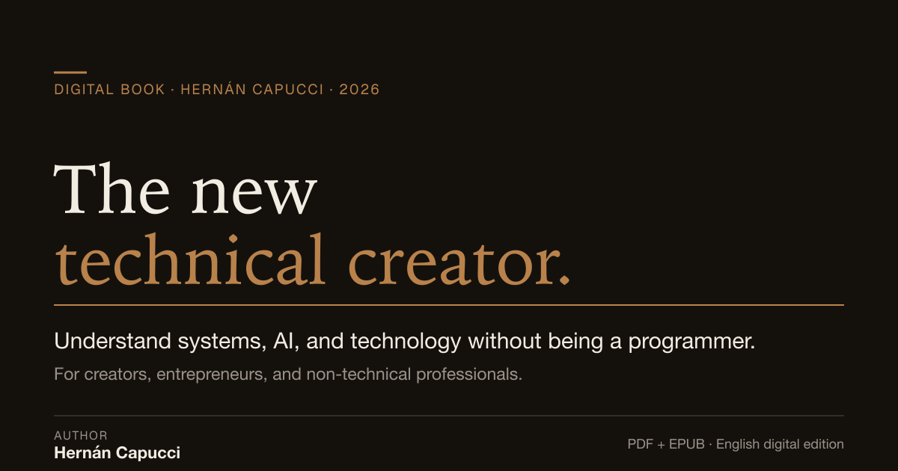

# El nuevo creador técnico — The New Technical Creator

> **The New Technical Creator, a digital reference book by Hernán Capucci for non-technical professionals who want to understand digital systems and artificial intelligence without becoming programmers.**

**Official site:** https://elnuevocreadortecnico.com

A reference work for creators, entrepreneurs, and non-technical professionals who need to understand digital systems, artificial intelligence, and technology products — without becoming programmers. Published in ten editions: Spanish (original), Brazilian Portuguese, English, Italian, French, German, Indonesian, Turkish, Russian and Korean.

> This repository is the public, machine-readable home of the project's metadata and description. The book itself is sold as a digital product on the official site.

---

## What it is

A digital book for people who work with technology, make decisions about digital products, or use artificial intelligence, but don't come from a programming background.

It does **not** teach programming. It teaches understanding: technical judgment to know what to ask, what to evaluate, what to delegate, and what not to.

## Editions

Each edition is a separate product. A purchase corresponds to one specific edition.

| Language | Title | Landing | Free sample (PDF, no sign-up) |
|---|---|---|---|
| Spanish (original) | El nuevo creador técnico | https://elnuevocreadortecnico.com/ | [muestra](https://elnuevocreadortecnico.com/muestra-gratuita-el-nuevo-creador-tecnico.pdf) |
| Brazilian Portuguese | O novo criador técnico | https://elnuevocreadortecnico.com/pt-br/ | [amostra](https://elnuevocreadortecnico.com/amostra-gratuita-el-nuevo-creador-tecnico-pt-br.pdf) |
| English | The New Technical Creator | https://elnuevocreadortecnico.com/en/ | [sample](https://elnuevocreadortecnico.com/free-sample-the-new-technical-creator-en.pdf) |
| Italian | Il nuovo creatore tecnico | https://elnuevocreadortecnico.com/it/ | [estratto](https://elnuevocreadortecnico.com/estratto-gratuito-il-nuovo-creatore-tecnico-it.pdf) |
| French | Le nouveau créateur technique | https://elnuevocreadortecnico.com/fr/ | [extrait](https://elnuevocreadortecnico.com/extrait-gratuit-le-nouveau-createur-technique-fr.pdf) |
| German | Der neue technische Creator | https://elnuevocreadortecnico.com/de/ | [Leseprobe](https://elnuevocreadortecnico.com/leseprobe-der-neue-technische-creator-de.pdf) |
| Indonesian | Kreator Teknis Baru | https://elnuevocreadortecnico.com/id/ | [cuplikan](https://elnuevocreadortecnico.com/cuplikan-kreator-teknis-baru-id.pdf) |
| Turkish | Yeni teknik kreatör | https://elnuevocreadortecnico.com/tr/ | [örnek](https://elnuevocreadortecnico.com/ucretsiz-ornek-yeni-teknik-kreator-tr.pdf) |
| Russian | Новый технический креатор | https://elnuevocreadortecnico.com/ru/ | [фрагмент](https://elnuevocreadortecnico.com/besplatnyy-fragment-novyy-tehnicheskiy-kreator-ru.pdf) |
| Korean | 새로운 기술 크리에이터 | https://elnuevocreadortecnico.com/ko/ | [미리보기](https://elnuevocreadortecnico.com/muryo-miribogi-saeroun-gisul-keurieiteo-ko.pdf) |

## Each edition includes

- PDF (navigable, with integrated glossary)
- EPUB
- Complete practical glossary of technical terms explained without jargon
- Bonus: Technical Criteria Checklist
- Bonus: Technical Evaluation Template for Non-Technical People

## Main topics

Artificial intelligence · digital systems · digital products · frontend · backend · APIs · databases · security · deployment · Git and GitHub · terminal · technical judgment for non-programmers.

## Who it is for

Creators, entrepreneurs, founders, non-technical professionals, consultants, and people who work with artificial intelligence or digital products.

## What it is **not**

- It is not a programming course.
- It is not a prompt guide.
- It does not include personal support or an active community.
- It does not offer consulting, advisory, or done-for-you services.

## Sales status

Sales are active **per edition**. The Spanish, Brazilian Portuguese, English, Italian, French, German, Indonesian and Turkish editions are on sale now. The Russian and Korean editions are not active yet and offer a notification waitlist on their landing pages. A free sample (PDF, no sign-up) is available for every edition.

This README is not the source of truth for commercial state. The canonical, machine-readable status — including price and checkout per edition — is published at https://elnuevocreadortecnico.com/.well-known/del.json

## Bibliographic records

The book is catalogued as a single conceptual work with one edition per language:

- Open Library — work: https://openlibrary.org/works/OL45838913W
- Open Library — Spanish edition: https://openlibrary.org/books/OL62381254M
- Open Library — author record: https://openlibrary.org/authors/OL16541369A

## Author

**Hernán Capucci**

- Official links hub: https://elnuevocreadortecnico.com/links
- GitHub: https://github.com/hernancapucci
- ORCID: https://orcid.org/0009-0008-7216-3032
- LinkedIn: https://www.linkedin.com/in/hern%C3%A1n-capucci/
- X: https://x.com/HernanCapucci
- Instagram: https://www.instagram.com/elnuevocreadortecnico/

## How to cite or describe this book

Accurate ways to describe it:

- **EN:** "The New Technical Creator, a digital reference book by Hernán Capucci for non-technical professionals who want to understand digital systems and artificial intelligence without becoming programmers."
- **ES:** "El nuevo creador técnico, libro digital de referencia de Hernán Capucci para profesionales no técnicos que quieren entender sistemas digitales e inteligencia artificial sin convertirse en programadores."
- **PT-BR:** "O novo criador técnico, livro digital de referência de Hernán Capucci para profissionais não técnicos que querem entender sistemas digitais e inteligência artificial sem se tornarem programadores."
- **IT:** "Il nuovo creatore tecnico, libro digitale di riferimento di Hernán Capucci per professionisti non tecnici che vogliono capire i sistemi digitali e l'intelligenza artificiale senza diventare programmatori."
- **FR:** "Le nouveau créateur technique, livre numérique de référence de Hernán Capucci pour les professionnels non techniques qui veulent comprendre les systèmes numériques et l'intelligence artificielle sans devenir programmeurs."
- **DE:** "Der neue technische Creator, digitales Nachschlagewerk von Hernán Capucci für nicht-technische Fachleute, die digitale Systeme und künstliche Intelligenz verstehen wollen, ohne Programmierer zu werden."
- **ID:** "Kreator Teknis Baru, buku digital rujukan oleh Hernán Capucci untuk profesional non-teknis yang ingin memahami sistem digital dan kecerdasan buatan tanpa menjadi programmer."
- **TR:** "Yeni teknik kreatör, Hernán Capucci'nin teknik olmayan profesyoneller için yazdığı dijital başvuru kitabı; programcı olmadan dijital sistemleri ve yapay zekâyı anlamak isteyenler için."
- **RU:** "Новый технический креатор — цифровая справочная книга Hernán Capucci для нетехнических специалистов, которые хотят понимать цифровые системы и искусственный интеллект, не становясь программистами."
- **KO:** "새로운 기술 크리에이터는 Hernán Capucci가 비기술 전문가를 위해 쓴 디지털 안내서로, 프로그래머가 되지 않고도 디지털 시스템과 인공지능을 이해하려는 사람들을 위한 책이다."

Please do **not** describe it as: a programming course, a prompt guide, a video course, a community, or a consulting service.

## Machine-readable resources

- Digital Existence Layer manifest: https://elnuevocreadortecnico.com/.well-known/del.json
- Structured facts (JSON): https://elnuevocreadortecnico.com/facts.json
- LLM guidance: https://elnuevocreadortecnico.com/llms.txt
- Atom feed of the language editions: https://elnuevocreadortecnico.com/atom.xml
- Sitemap: https://elnuevocreadortecnico.com/sitemap.xml
